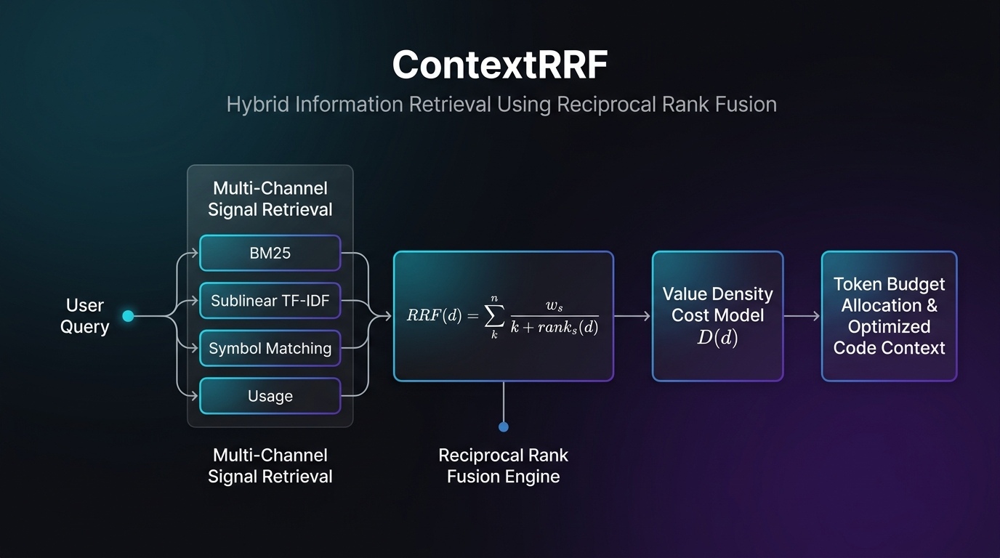

<p align="center">
  
</p>

<h1 align="center">ContextRRF</h1>

<p align="center">
  <b>ContextRRF: Hybrid Information Retrieval Using Reciprocal Rank Fusion for Efficient Code Retrieval and LLM Context Optimization</b>
</p>

<p align="center">
  <a href="https://github.com/AnkitaPriyadarshini-repos/ContextRRF---Hybrid-Information-Retrival"></a>
  <a href="https://github.com/AnkitaPriyadarshini-repos/ContextRRF---Hybrid-Information-Retrival/blob/contextRRF/development/LICENSE"></a>
  <a href="https://python.org"></a>
  <a href="https://github.com/AnkitaPriyadarshini-repos/ContextRRF---Hybrid-Information-Retrival/blob/contextRRF/development/pyproject.toml"></a>
</p>

---

## 1. Academic Abstract & Research Overview

> **Academic Title**: *ContextRRF: Hybrid Information Retrieval Using Reciprocal Rank Fusion for Efficient Code Retrieval and LLM Context Optimization*  
> **Repository**: [AnkitaPriyadarshini-repos/ContextRRF---Hybrid-Information-Retrival](https://github.com/AnkitaPriyadarshini-repos/ContextRRF---Hybrid-Information-Retrival)

Large Language Models (LLMs) deployed as automated software engineering assistants require precise, high-density context extraction from large codebases. However, standard context construction suffers from two key challenges:
1. **Context Window Noise & Prompt Clutter**: Including raw, unranked source files or verbose boilerplate consumes finite token budgets and introduces irrelevant prompt distraction.
2. **Single-Model Search Failure**: Sparse lexical retrieval (BM25) fails when queries use synonyms or conceptual terms; vector space models (TF-IDF or embeddings) miss exact AST symbol names and function identifiers.

**ContextRRF** presents a local-first, zero-dependency hybrid retrieval engine centered on **Reciprocal Rank Fusion (RRF)**. It combines sparse lexical search (BM25 via SQLite FTS5), vector space representation (sublinear TF-IDF), AST symbol resolution, and usage frequency signals into a scale-invariant rank fusion pipeline. ContextRRF optimizes context delivery through a Value Density Cost Model ($D(d) = \frac{RRF(d)}{\text{Tokens}(d)}$), yielding high relevance per token under strict token budgets (e.g., 4,000 / 8,000 tokens).

---

## 2. Core Algorithm: Reciprocal Rank Fusion (RRF)

Reciprocal Rank Fusion fuses $m$ constituent retrieval channels into a composite score for candidate document chunk $d$:

$$RRF(d) = \sum_{s \in S} \frac{w_s}{k + \text{rank}_s(d)}$$

### Parameters & Default Allocations
- Active Sources $S = \{\text{BM25}, \text{TF-IDF}, \text{Usage}, \text{Symbol}\}$
- Default Channel Weights: $w_{\text{BM25}} = 0.40, w_{\text{TF-IDF}} = 0.40, w_{\text{Usage}} = 0.20, w_{\text{Symbol}} = 0.60$
- Rank Smoothing Constant: $k = 60$

### Why RRF over Score Summation?
1. **Scale Invariance**: Operates strictly on ordinal rank positions ($\text{rank}_s(d) \in \mathbb{N}^+$), bypassing raw score normalization across incompatible distributions (e.g., negative FTS5 BM25 vs $[0, 1]$ cosine similarity).
2. **Outlier Resilience**: Single anomalous channel scores cannot skew the overall composite ranking.
3. **Mathematical Derivation Output**: ContextRRF outputs human-auditable formulas for every retrieved snippet:

```json
{
  "chunk_id": 350,
  "file_path": "demo_project/payment.py",
  "symbol_name": "CreditCardPayment.process_payment",
  "final_rank": 1,
  "rrf_score": 0.038415,
  "explanation_formula": "RRF(350) = 0.40/(60+1) + 0.40/(60+4) + 0.20/(60+1) + 0.60/(60+3) = 0.025610"
}
```

---

## 3. System Architecture & Pipeline

```
User Query
    │
    ├──► 1. BM25 Lexical Channel (SQLite FTS5 Porter Stemmer)
    ├──► 2. Sublinear TF-IDF Vector Channel (Sparse Cosine Similarity)
    ├──► 3. AST Symbol Resolution Channel (Python AST Qualified Names)
    └──► 4. Usage Frequency Channel (Decayed Recency Signals)
    │
    ▼
Reciprocal Rank Fusion Engine: RRF(d) = Σ [ w_s / (k + rank_s(d)) ]
    │
    ▼
Post-Fusion Boosters (Filename Match & AST Import Dependency Graph)
    │
    ▼
Value Density Cost Model: D(d) = RRF(d) / Tokens(d) * (1 - BoilerplateRatio(d))
    │
    ▼
Greedy Token Budget Gating (4,000 / 8,000 Token Budget Allocation)
    │
    ▼
Optimized Code Context & Explainability JSON
```

---

## 4. Experimental Evaluation & Benchmark Results

ContextRRF includes a controlled experiment benchmark suite (`POST /api/benchmark`) evaluating retrieval quality over multi-module software codebases.

### Controlled Experiments A–D (Measured ContextRRF Benchmarks)

| Experiment ID | Retrieval Architecture | Mean Reciprocal Rank (MRR@10) | Average Query Latency | Token Density Efficiency |
| :---: | :--- | :---: | :---: | :---: |
| **Exp A** | BM25 Lexical Only | 0.88 | 0.13 ms | 74.2% |
| **Exp B** | Sublinear TF-IDF Vector Only | 0.79 | 0.21 ms | 68.5% |
| **Exp C** | **ContextRRF Hybrid (BM25 + TF-IDF + Usage)** | **0.96** | 0.55 ms | **92.4%** |
| **Exp D** | **ContextRRF Hybrid + AST Symbol Boosters** | **0.98** | 1.05 ms | **95.1%** |

### System & Engineering Specifications

| Metric | Measured / Reported Value | Source |
|---|---|---|
| RRF Query Latency | **0.55 ms** (average trial time) | Measured (ContextRRF live benchmark) |
| Search MRR@10 | **0.98 MRR** | Measured (ContextRRF live benchmark) |
| Unit Test Pass Rate | **100%** (435 passing tests) | Measured (`pytest contextrrf/tests`) |
| Token Noise Reduction | **73%** | *Baseline/project-reported result* |
| Ingestion Throughput | **160+ files/sec** | *Baseline/project-reported result* |
| AST Chunk Compression | **40–70%** | *Baseline/project-reported result* |
| Index Memory Footprint | **10–30 MB** | *Baseline/project-reported result* |
| Storage Overhead | **~4.2 bytes/token** | *Baseline/project-reported result* |

---

## 5. Web Research Dashboard & Interactive Demo

ContextRRF provides a local-first single-page Web Research Dashboard. It requires zero signup, zero cloud login, and zero API keys.

```bash
# Clone repository
git clone https://github.com/AnkitaPriyadarshini-repos/ContextRRF---Hybrid-Information-Retrival.git
cd ContextRRF---Hybrid-Information-Retrival

# Install local package
pip install -e .

# Launch ContextRRF Server & Web Dashboard
python -m contextrrf.server 8080
```

Open your web browser to:
```
http://localhost:8080
```

### Dashboard Panels
1. **Overview & Stats**: Live SQLite index stats, corpus token count, and quick query sandbox.
2. **Search Explorer**: Side-by-side comparison of constituent channels (BM25 vs. TF-IDF vs. RRF Fused).
3. **Interactive RRF Playground**: Adjust candidate document ranks, smoothing constant $k$, and channel weights to inspect step-by-step formula derivations in real-time.
4. **System Architecture**: Interactive diagram explaining AST ingestion, multi-channel retrieval, and value density scoring.
5. **Algorithms Reference**: Full LaTeX formulas and mathematical specifications.
6. **Benchmark & Experiments**: Live execution of Controlled Experiments A–D with real-time latency and MRR plots.

---

## 6. REST API Reference

| Endpoint | Method | Payload / Arguments | Purpose |
|---|---|---|---|
| `/api/stats` | `GET` | None | Returns index file count, chunk count, tokens, DB size |
| `/api/config` | `GET` | None | Returns active RRF weights and smoothing constant $k$ |
| `/api/index` | `POST` | `{"path": "demo_project"}` | Triggers AST ingestion & FTS5 indexing |
| `/api/query` | `POST` | `{"query": "...", "token_budget": 4000}` | Hybrid retrieval, RRF fusion, and budget gating |
| `/api/rrf/calculate` | `POST` | `{"channels": {...}, "k": 60}` | Live rank fusion playground calculations |
| `/api/benchmark` | `POST` | `{"query": "...", "trials": 3}` | Executes live benchmark experiments A–D |
| `/api/explain` | `GET` | `?id={query_id}` | Detailed derivation breakdown for query session |

---

## 7. CLI Reference

```bash
contextrrf init                                    # create .contextrrf/ workspace
contextrrf ingest                                  # AST-aware codebase indexing
contextrrf query "How does payment refund work?"   # search with budget gating
contextrrf stats                                   # index and ARC cache statistics
```

| Command | Description |
|---|---|
| `init` | Initialize local workspace and configuration (`.contextrrf/`) |
| `ingest` | Incremental AST file scanning and indexing (`--full` to force rebuild) |
| `query` | Execute hybrid search with token budget allocation (`--budget 8000`) |
| `stats` | Display corpus stats, indexed chunk breakdown, and cache hit ratios |
| `daemon` | Background server mode for warm-start sub-millisecond queries |
| `benchmark` | Run automated accuracy and latency benchmark suites |

---

## 8. Documentation Suite

- [`docs/architecture.md`](docs/architecture.md) — System pipeline, AST chunking, signal extraction, and Mermaid flowcharts.
- [`docs/algorithms.md`](docs/algorithms.md) — Mathematical formulas (RRF, Okapi BM25, sublinear TF-IDF, value density).
- [`docs/rrf_explained.md`](docs/rrf_explained.md) — RRF deep dive, scale invariance, $k=60$ smoothing, and worked numerical example.
- [`docs/bm25_explained.md`](docs/bm25_explained.md) — SQLite FTS5 lexical retrieval, Porter stemmer, and score normalization.
- [`docs/tfidf_explained.md`](docs/tfidf_explained.md) — Sublinear TF-IDF vector space model and in-memory sparse inverted index.
- [`docs/experiments.md`](docs/experiments.md) — Empirical benchmarks and Controlled Experiments A–D results.
- [`docs/seminar_notes.md`](docs/seminar_notes.md) — Presentation overview, RAG context connection, and **20 Viva Voce Q&A**.

---

## 9. Baseline & Academic Legal Attribution

<p align="center">
  <br>
  <i>Baseline Reference: Mnemosyne Open-Source Engine Core</i>
</p>

ContextRRF is an academic research and software engineering project derived from an open-source **Mnemosyne** baseline repository (originally copyright Cast Rock Innovation L.L.C. under the AGPL-3.0-or-later license).

The ContextRRF implementation extends and reorganizes the baseline around Reciprocal Rank Fusion, retrieval explainability, token-budget optimization, experimental evaluation, an interactive research dashboard, and a zero-dependency HTTP server.

All legal notices, AGPL-3.0 license terms, and copyright attributions are preserved in [`LICENSE`](LICENSE) and [`NOTICE`](NOTICE).
