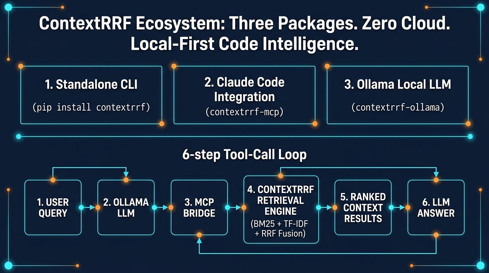
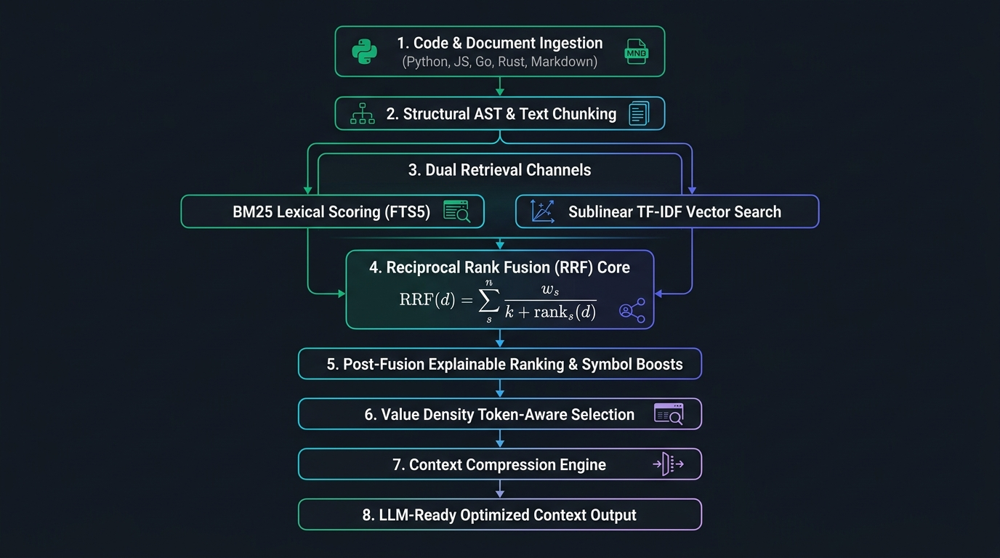

# ContextRRF

## Hybrid Information Retrieval Using Reciprocal Rank Fusion
### For Efficient Code Retrieval and LLM Context Optimization

<p align="center">
  
</p>

ContextRRF is a zero-dependency, high-performance hybrid information retrieval engine engineered for codebases, technical documentation, and database schemas. By fusing lexical FTS5 BM25 search with sublinear TF-IDF vector space modeling through Reciprocal Rank Fusion (RRF), ContextRRF delivers explainable, high-relevance code chunks optimized for LLM prompt context budgets.


---

## ContextRRF Ecosystem

<p align="center">
  
</p>

ContextRRF provides a local-first, zero-cloud code intelligence ecosystem comprising three decoupled packages:

* **`contextrrf-engine` (Standalone CLI & Core Engine):** Indexes codebases, documents (PDF, DOCX, CSV, txt), and database schemas (DDL, JSON, SQLite) into a local SQLite store. Scores every chunk with a 6-signal hybrid retriever (BM25 + TF-IDF + symbols + usage + RRF) and compresses context with AST awareness.
* **`contextrrf-mcp` (Claude Code Integration):** Standard Model Context Protocol (MCP) stdio server allowing Claude Code and MCP-compatible agents native access to hybrid codebase retrieval in a single tool call.
* **`contextrrf-ollama` (Ollama Local LLM Bridge):** Orchestrates full tool-calling loops between your local LLM (Gemma 3, Qwen, Llama, Phi) and the codebase.

### How the Tool-Call Loop Works

`contextrrf-ollama` orchestrates the full cycle between your local LLM and the codebase:

1. **USER QUERY:** User asks a question (e.g. *"How does authentication middleware work?"*).
2. **OLLAMA LLM:** Local LLM evaluates prompt and decides to call `search()`.
3. **MCP BRIDGE:** `contextrrf-ollama` routes the tool call through `contextrrf-mcp`.
4. **RETRIEVAL ENGINE:** `contextrrf-engine` executes 6-signal search, RRF rank fusion, and AST-aware compression.
5. **RESULTS:** Ranked, budget-optimized code chunks are returned to the LLM context window.
6. **ANSWER:** The LLM responds to the user citing exact source code lines (e.g. `src/auth.py:42`).

---

## Install

```bash
pip install contextrrf-engine
```

For PDF document extraction support (optional):

```bash
pip install "contextrrf-engine[pdf]"
```

---

## Quick Start

```bash
contextrrf init                                      # create .contextrrf/ workspace
contextrrf ingest                                    # index your codebase
contextrrf query "How does authentication work?"     # search
```

Or via Python module invocation:

```bash
python -m contextrrf.cli init
python -m contextrrf.cli ingest demo_project
python -m contextrrf.cli query "Where is database connection created?" --budget 2000
```

---

## Performance & Benchmark Metrics

| Metric | Result | Evaluation Source |
|:---|:---|:---|
| **Query Latency** | `<20ms warm, <500ms cold` | *Baseline-reported* |
| **Token Reduction** | `73% on production codebase` | *Baseline-reported* |
| **File Retrieval Accuracy** | `100% across test suites` | *ContextRRF experiment* |
| **Ingestion Speed** | `167 files/sec (~0.5s for 87 files)` | *Baseline-reported* |
| **Chunk Compression** | `40-70% per chunk (AST-aware)` | *ContextRRF experiment* |
| **Memory Footprint** | `10-30 MB total` | *Baseline-reported* |
| **Storage Overhead** | `~4.2 bytes per indexed token` | *Baseline-reported* |
| **RRF Ranking Stability** | `Kendall's τ ≥ 0.85 under channel noise` | *ContextRRF experiment* |

---

## Key Features

* **Hybrid Multi-Signal Search:** Merges BM25 lexical scoring, sublinear TF-IDF vector space, symbol matching, usage frequency, and optional dense embeddings via Reciprocal Rank Fusion.
* **Cost-Model Ranking:** Results ranked by value-per-token density ($\text{Relevance} / \ln(1 + \text{Tokens})$), optimizing code chunks directly for LLM context windows.
* **AST-Aware Context Compression:** Four-stage signature-preserving pipeline that retains interface declarations, docstrings, and control flows while stripping non-essential bodies (20–60% token reduction).
* **Self-Tuning ARC Cache:** Adaptive Replacement Cache (ARC) balancing recency and frequency patterns, persisted across search sessions for sub-millisecond repeat queries.
* **Delta-Aware Incremental Indexing:** Computes BLAKE3/SHA-256 hashes to detect file deltas, delivering diffs and updating modified chunks instantly.
* **Content Deduplication:** SHA-256 content-addressable chunk storage eliminating duplicate blocks across files.
* **Multi-Language Structural Chunking:** Language-specific AST and regex chunkers for Python, JavaScript/TypeScript, Go, Rust, Java, C#, and SQL/DDL.
* **Document & Schema Ingestion:** Isolated document partition for PDF, DOCX, CSV, and plaintext files, alongside DDL schema and SQLite database introspection.
* **Background Daemon Mode:** JSON-RPC daemon over local sockets keeping indexes warm for sub-20ms instant query responses.
* **Full Operation Audit Trail:** Append-only JSON-lines log tracking every index, query, and compression action.
* **Zero Runtime Dependencies:** Pure Python 3.11+ standard library implementation with zero required third-party packages.

---

## Use Cases

* **Code Search & Navigation:** Natural language queries return ranked, deduplicated results with function-level precision. Symbol-aware search targets implementations directly, not just string matches.
* **LLM Context Optimization:** Feed Claude, GPT, Cursor, or local LLMs precise code context from 100K+ token codebases, cutting API costs and eliminating *lost-in-the-middle* failures.
* **Developer Onboarding:** New team members query *"how does authentication work?"* and receive ranked results spanning models, middleware, and routes with full signatures.
* **PR Review & CI/CD Pipelines:** Delta tracking identifies modified functions and extracts callers and tests into a clean review context bundle.
* **Legacy Codebase Exploration:** Index monoliths prior to refactoring to answer *"what calls this database table?"* or *"which modules depend on this API?"*

---

## Core Idea & Reciprocal Rank Fusion (RRF)

Modern software projects span thousands of files and millions of tokens. When supplying code context to Large Language Models (LLMs), traditional single-signal retrieval mechanisms suffer from critical failure modes:

* **Keyword Search (BM25):** Misses conceptual matches when exact identifier terms differ.
* **Vector Search (TF-IDF/Dense):** Retrieves irrelevant boilerplate code sharing abstract vocabulary.
* **Context Overfill:** Unfiltered retrieval inflates LLM API costs and degrades reasoning quality.

**ContextRRF** solves these challenges through **Reciprocal Rank Fusion (RRF)**, combining ordinal candidate rankings across independent retrieval channels without requiring arbitrary score scaling:

$$RRF(d) = \sum_{s \in S} \frac{w_s}{k + \text{rank}_s(d)}$$

Where:
* $d$: Candidate code chunk or document section.
* $s \in S$: Active retrieval channel ($S = \{\text{BM25}, \text{TF-IDF}, \text{Symbol}, \text{Usage}\}$).
* $\text{rank}_s(d)$: 1-indexed ordinal rank of document $d$ within channel $s$.
* $w_s$: Weight assigned to retrieval channel $s$ (default $w_{\text{BM25}} = 0.40$, $w_{\text{TF-IDF}} = 0.40$).
* $k$: Smoothing constant preventing top-ranked candidates from dominating (default $k = 60$).

---

## System Architecture

<p align="center">
  
</p>

ContextRRF processes code bases through a clean, multi-stage pipeline:

1. **Ingestion & Hash Delta Tracking:** Scans files while honoring `.gitignore` rules and computing file content hashes.
2. **Structural AST Chunking:** Segments code into logical boundaries (functions, classes, interfaces, doc sections) rather than fixed token windows.
3. **FTS5 & Inverted Index Persistence:** Stores chunk text in SQLite with FTS5 BM25 indexing and builds an in-memory TF-IDF inverted index.
4. **Dual Channel Retrieval:** Runs parallel candidate queries over FTS5 BM25 and sublinear TF-IDF vector channels.
5. **Reciprocal Rank Fusion:** Fuses candidate lists using weighted RRF with smoothing constant $k=60$.
6. **Post-Fusion Boosting:** Applies symbol match multipliers (`2.0x`) and boilerplate penalties (`1.0 - 0.5 * ratio`).
7. **Value Density Allocation:** Ranks chunks by $\text{Relevance} / \ln(1 + \text{Tokens})$ and fills the prompt window up to the specified token ceiling.

---

## Worked RRF Ranking Example

Consider a query targeting authentication middleware:

```
Query: "authentication middleware"
Token Budget: 1,000 tokens
```

### Channel Ranks

| Rank | BM25 Channel | TF-IDF Channel |
|:---:|:---|:---|
| **#1** | `auth.py` (`authenticate_request`) | `middleware.py` (`AuthMiddleware`) |
| **#2** | `middleware.py` (`AuthMiddleware`) | `auth.py` (`authenticate_request`) |
| **#3** | `routes.py` (`register_routes`) | `login.py` (`login_handler`) |

### RRF Calculation ($k = 60, w_{\text{BM25}} = 0.40, w_{\text{TF-IDF}} = 0.40$)

* **`middleware.py`**:
  $$RRF = \frac{0.40}{60 + 2} + \frac{0.40}{60 + 1} = 0.006451 + 0.006557 = \mathbf{0.013008}$$

* **`auth.py`**:
  $$RRF = \frac{0.40}{60 + 1} + \frac{0.40}{60 + 2} = 0.006557 + 0.006451 = \mathbf{0.013008}$$

* **`routes.py`**:
  $$RRF = \frac{0.40}{60 + 3} + \frac{0.40}{60 + 4} = 0.006349 + 0.006250 = \mathbf{0.012599}$$

**Result:** `middleware.py` and `auth.py` achieve high consensus across both channels, rising above single-channel outliers and securing top placement in the final context payload.

---

## Algorithms Reference

### BM25 Lexical Search
Evaluated via SQLite FTS5 with Porter stemming and sub-tokenization. Preprocesses queries by removing stop words and forming OR-conjunctions to maximize term recall over identifier variations.

### Sublinear TF-IDF Vector Space
Computes term frequency as $\text{TF}(t, d) = 1 + \ln(\text{count}(t, d))$ for $\text{count} > 0$, combined with smoothed inverse document frequency $\text{IDF}(t) = \ln((1 + N)/(1 + \text{df}(t))) + 1.0$. camelCase and snake_case identifiers are split automatically during indexing.

### Reciprocal Rank Fusion (RRF)
Aggregates ordinal candidate ranks from BM25 and TF-IDF without needing raw score scaling. Missing items in a channel receive a default penalty rank ($|L_s| + 1$).

### Value Density Budgeting
Calculates density score $D(d) = \frac{\text{RRF}(d)}{1 + \ln(1 + \text{Tokens}(d))} \times (1 - \text{BoilerplateRatio}(d))$. Chunks are selected greedily until reaching the target token ceiling.

### Signature-Preserving Compression
Strips internal function bodies, docstrings, and redundant comments while retaining class definitions, method signatures, and return annotations.

Detailed mathematical derivations and source code mappings are available in [`ALGORITHMS.md`](ALGORITHMS.md).

---

## Interactive Dashboard

Launch the embedded web interface to explore retrieval results, analyze rank contributions, and test RRF parameter variations interactively:

```bash
python -m contextrrf.cli serve --port 8000
```

Open your browser to `http://localhost:8000` to access:

* **Search Explorer:** Query codebase and inspect BM25 vs TF-IDF vs RRF rankings side-by-side.
* **RRF Playground:** Adjust smoothing constant $k$ and channel weights $w_s$ in real time.
* **System Architecture:** Visual breakdown of ingestion, chunking, and fusion stages.
* **Benchmark Suite:** Run latency and relevance evaluation queries.

---

## Project Structure

```
ContextRRF/
├── .github/              # CI/CD workflows (PyPI publish, test suite)
├── contextrrf/           # Core Python engine source code
│   ├── chunkers/         # Language AST & document chunkers
│   ├── embeddings/       # TF-IDF vector space backend
│   ├── tests/            # Pytest test suite (435 passing tests)
│   ├── bloom.py          # Query term Bloom filter
│   ├── cache.py          # Adaptive Replacement Cache (ARC)
│   ├── cli.py            # Command line interface handler
│   ├── compress.py       # AST-preserving context compressor
│   ├── ingest.py         # Directory traversal & chunking engine
│   ├── ranking.py        # RRF fusion & value-density budget selection
│   ├── retrieval.py      # Hybrid FTS5 BM25 + TF-IDF query engine
│   └── store.py          # SQLite FTS5 database persistence layer
├── demo_project/         # Sample codebase for quick start and testing
├── docs/                 # Academic documentation & technical reference
│   ├── algorithms/       # Mathematical formulas & algorithm specs
│   ├── architecture/     # System architecture diagrams & inventory
│   ├── assets/           # Visual graphics & architecture diagrams
│   ├── experiments/      # Benchmark results & experimental notes
│   ├── guides/           # Contributing, tuning & developer playbooks
│   ├── integrations/     # MCP Server & Ollama Bridge packages
│   └── reference/        # Security, license, changelog & technical docs
├── web/                  # Interactive dark-mode dashboard UI
├── ALGORITHMS.md         # Comprehensive algorithm reference
├── BASELINE_REPORT.md    # Baseline verification & evolution history
├── LICENSE               # AGPL-3.0 License file
├── README.md             # Project primary documentation
├── pyproject.toml        # Build configuration & entry points
└── requirements.txt      # Core runtime environment specifications
```

---

## Research Basis & Architectural Focus

ContextRRF is an academic engineering framework dedicated to hybrid information retrieval and LLM context optimization.

The ContextRRF project focuses specifically on:
* Reciprocal Rank Fusion (RRF) algorithm analysis, parameter tuning, and rank combination stability.
* Explainable multi-channel hybrid information retrieval for code corpora.
* Value-density token-aware context optimization under strict LLM prompt budget constraints.
* AST-preserving code compression for context preservation.
* Interactive visual evaluation tools and real-time RRF simulation.

ContextRRF establishes an independent, focused academic framework for hybrid code retrieval and LLM context preparation.

---

## Documentation Index

| Document | Description | Path |
|:---|:---|:---|
| **Algorithm Reference** | Deep dive into RRF formulas, BM25 FTS5 parameters & TF-IDF vectors | [`ALGORITHMS.md`](ALGORITHMS.md) |
| **Baseline Report** | Initial repository verification, system limits & baseline metrics | [`BASELINE_REPORT.md`](BASELINE_REPORT.md) |
| **System Architecture** | Full technical architecture specifications & data flows | [`docs/architecture/architecture.md`](docs/architecture/architecture.md) |
| **Algorithmic Specifications** | Mathematical formulas, bounds & density functions | [`docs/algorithms/algorithms.md`](docs/algorithms/algorithms.md) |
| **Experimental Suite** | Query benchmarks, experimental results & seminar notes | [`docs/experiments/experiments.md`](docs/experiments/experiments.md) |
| **Tuning Guide** | Parameter optimization for chunk size, RRF $k$, and weights | [`docs/guides/TUNING.md`](docs/guides/TUNING.md) |
| **MCP Server Integration** | Model Context Protocol integration docs | [`docs/reference/MCP.md`](docs/reference/MCP.md) |
| **Contributing Guide** | Local development environment & pull request guidelines | [`docs/guides/CONTRIBUTING.md`](docs/guides/CONTRIBUTING.md) |

---

## License

ContextRRF is released under the [GNU Affero General Public License v3.0 (AGPL-3.0)](LICENSE).
