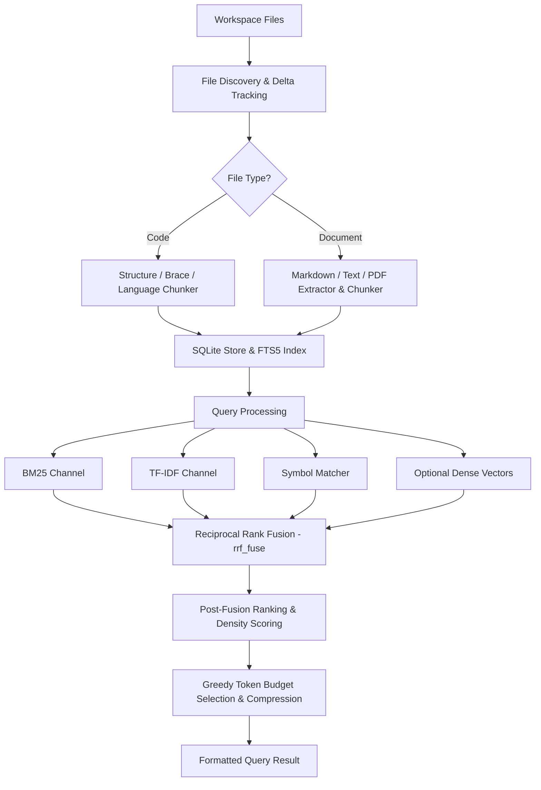

# Architecture Inventory — Mnemosyne (v1.1.0 Baseline)

This document provides a comprehensive inventory of all major subsystems, entry points, data pipelines, ranking mechanisms, storage layers, and integrations in Mnemosyne, mapped directly to their actual source files.

---

## Component Mapping Table

| No. | Subsystem / Feature | Primary Source File(s) | Description |
|---|---|---|---|
| 1 | **Entry Points** | [`pyproject.toml`](file:///c:/Users/ankit/ContextRRF/pyproject.toml) [`mnemosyne/__main__.py`](file:///c:/Users/ankit/ContextRRF/mnemosyne/__main__.py) [`mnemosyne/__init__.py`](file:///c:/Users/ankit/ContextRRF/mnemosyne/__init__.py) | Defines `mnemosyne = mnemosyne.cli:main` executable entry point and module initializers. |
| 2 | **CLI Interface** | [`mnemosyne/cli.py`](file:///c:/Users/ankit/ContextRRF/mnemosyne/cli.py) | Full command-line parser (`argparse`) supporting `init`, `ingest`, `query`, `stats`, `daemon`, `purge`, `audit`, etc. |
| 3 | **Indexing Pipeline** | [`mnemosyne/ingest.py`](file:///c:/Users/ankit/ContextRRF/mnemosyne/ingest.py) [`mnemosyne/schema_ingest.py`](file:///c:/Users/ankit/ContextRRF/mnemosyne/schema_ingest.py) | Scans workspace, calculates content hashes, orchestrates language-specific chunking, extracts symbols, updates SQLite FTS5 index. |
| 4 | **File Discovery** | [`mnemosyne/ingest.py`](file:///c:/Users/ankit/ContextRRF/mnemosyne/ingest.py) | File crawler handling recursive traversal, `.gitignore` / ignore pattern evaluation, file size limits, and binary file filtering. |
| 5 | **Code Chunking** | [`mnemosyne/chunkers/code_chunker.py`](file:///c:/Users/ankit/ContextRRF/mnemosyne/chunkers/code_chunker.py) [`mnemosyne/chunkers/brace_chunker.py`](file:///c:/Users/ankit/ContextRRF/mnemosyne/chunkers/brace_chunker.py) [`mnemosyne/chunkers/js_chunker.py`](file:///c:/Users/ankit/ContextRRF/mnemosyne/chunkers/js_chunker.py) [`mnemosyne/chunkers/py_chunker` / generic] | Structure-aware AST/regex code chunkers for Python, JavaScript/TypeScript, Go, Rust, C#, Java, and brace-delimited languages. |
| 6 | **Document Chunking** | [`mnemosyne/chunkers/document_chunker.py`](file:///c:/Users/ankit/ContextRRF/mnemosyne/chunkers/document_chunker.py) [`mnemosyne/chunkers/text_chunker.py`](file:///c:/Users/ankit/ContextRRF/mnemosyne/chunkers/text_chunker.py) [`mnemosyne/extractors/`](file:///c:/Users/ankit/ContextRRF/mnemosyne/extractors) | Section and paragraph-based splitters for Markdown, plain text, PDF, CSV, and DOCX files. |
| 7 | **SQLite Storage & Schema** | [`mnemosyne/store.py`](file:///c:/Users/ankit/ContextRRF/mnemosyne/store.py) [`mnemosyne/schema.py`](file:///c:/Users/ankit/ContextRRF/mnemosyne/schema.py) [`mnemosyne/doc_store.py`](file:///c:/Users/ankit/ContextRRF/mnemosyne/doc_store.py) | Manages relational tables (`files`, `chunks`, `symbols`, `access_log`) and SQLite `fts5` virtual table for full-text search. |
| 8 | **BM25 Retrieval** | [`mnemosyne/retrieval.py`](file:///c:/Users/ankit/ContextRRF/mnemosyne/retrieval.py) | Queries SQLite FTS5 index using BM25 scoring algorithm over chunk content and symbol signatures. |
| 9 | **TF-IDF Retrieval** | [`mnemosyne/embeddings/tfidf_backend.py`](file:///c:/Users/ankit/ContextRRF/mnemosyne/embeddings/tfidf_backend.py) | In-memory TF-IDF indexer with custom sub-linear term weighting and cosine similarity vector scoring. |
| 10 | **Optional Dense Retrieval** | [`mnemosyne/embeddings/dense_backend.py`](file:///c:/Users/ankit/ContextRRF/mnemosyne/embeddings/dense_backend.py) | ONNX Runtime based embedding model integration (e.g. MiniLM-L6-v2) for vector search when `[dense]` is installed. |
| 11 | **Symbol Retrieval** | [`mnemosyne/retrieval.py`](file:///c:/Users/ankit/ContextRRF/mnemosyne/retrieval.py) [`mnemosyne/store.py`](file:///c:/Users/ankit/ContextRRF/mnemosyne/store.py) | Matches query identifiers against extracted function names, class definitions, and variable signatures. |
| 12 | **Usage Signals** | [`mnemosyne/retrieval.py`](file:///c:/Users/ankit/ContextRRF/mnemosyne/retrieval.py) [`mnemosyne/store.py`](file:///c:/Users/ankit/ContextRRF/mnemosyne/store.py) | Tracks access frequency and recency per chunk, applying recency boosts to frequently queried code paths. |
| 13 | **Prefetching** | [`mnemosyne/prefetch.py`](file:///c:/Users/ankit/ContextRRF/mnemosyne/prefetch.py) | Analyzes imports and file dependencies to prefetch related neighbor chunks during retrieval. |
| 14 | **Reciprocal Rank Fusion (RRF)** | [`mnemosyne/ranking.py`](file:///c:/Users/ankit/ContextRRF/mnemosyne/ranking.py) [`mnemosyne/retrieval.py`](file:///c:/Users/ankit/ContextRRF/mnemosyne/retrieval.py) | Merges ranked lists from BM25, TF-IDF, Symbol, and Dense channels into a single unified score list using $RRF(d) = \sum \frac{w_s}{k + r_s(d)}$. |
| 15 | **Post-Fusion Ranking** | [`mnemosyne/ranking.py`](file:///c:/Users/ankit/ContextRRF/mnemosyne/ranking.py) [`mnemosyne/retrieval.py`](file:///c:/Users/ankit/ContextRRF/mnemosyne/retrieval.py) | Applies filename match boosts, symbol boosts, boilerplate penalties, and computes value density scores. |
| 16 | **Token-Budget Selection** | [`mnemosyne/ranking.py`](file:///c:/Users/ankit/ContextRRF/mnemosyne/ranking.py) | Greedy selection algorithm (`budget_cut`) that fills token budget based on value density and falls back to chunk compression when needed. |
| 17 | **Compression** | [`mnemosyne/compress.py`](file:///c:/Users/ankit/ContextRRF/mnemosyne/compress.py) | Content compressor stripping docstrings, comments, whitespace, and thinning non-essential lines while preserving code structure. |
| 18 | **Caching** | [`mnemosyne/cache.py`](file:///c:/Users/ankit/ContextRRF/mnemosyne/cache.py) | Query result LRU cache store with TTL invalidation to return sub-millisecond cached search responses. |
| 19 | **Bloom Filter** | [`mnemosyne/bloom.py`](file:///c:/Users/ankit/ContextRRF/mnemosyne/bloom.py) | In-memory probabilistic set filter for rapid non-existent query term filtering before executing full database lookups. |
| 20 | **Delta Tracking** | [`mnemosyne/delta.py`](file:///c:/Users/ankit/ContextRRF/mnemosyne/delta.py) | Content hashing (BLAKE3/SHA256) and timestamp comparison to enable fast incremental re-ingestion of changed files. |
| 21 | **Analytics & Audit** | [`mnemosyne/analytics.py`](file:///c:/Users/ankit/ContextRRF/mnemosyne/analytics.py) [`mnemosyne/audit.py`](file:///c:/Users/ankit/ContextRRF/mnemosyne/audit.py) | Aggregates database usage metrics, index sizes, query throughput, compression ratios, and integrity auditing. |
| 22 | **Daemon / JSON-RPC** | [`mnemosyne/daemon.py`](file:///c:/Users/ankit/ContextRRF/mnemosyne/daemon.py) | Background socket server exposing JSON-RPC API endpoints for low-latency external client integrations. |
| 23 | **MCP Integration** | [`mcp/src/mnemosyne_mcp/server.py`](file:///c:/Users/ankit/ContextRRF/mcp/src/mnemosyne_mcp/server.py) | Model Context Protocol (MCP) server integration bringing Mnemosyne tools directly into Anthropic Claude / IDE hosts. |
| 24 | **Ollama Integration** | [`ollama/src/mnemosyne_ollama/agent.py`](file:///c:/Users/ankit/ContextRRF/ollama/src/mnemosyne_ollama) | Bridge CLI and agent integration for serving context to local Ollama LLMs. |
| 25 | **Test Suite** | [`mnemosyne/tests/`](file:///c:/Users/ankit/ContextRRF/mnemosyne/tests) | 24 pytest integration, benchmark, chunker, retrieval, and store unit test suites. |

---

## Detailed Pipeline Flow

