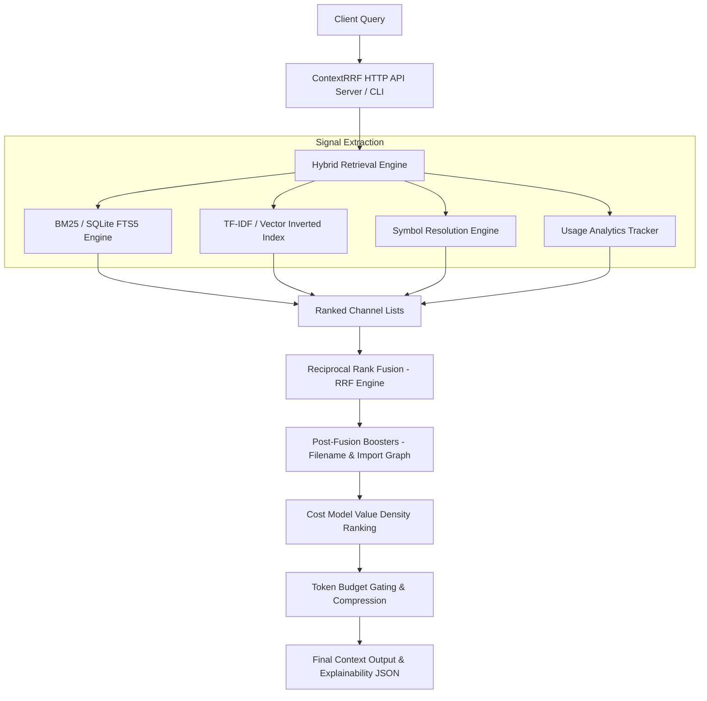

# ContextRRF Architecture & System Overview

## Academic Context & Motivation
Large Language Models (LLMs) used in software engineering tasks require precise context extraction from large codebases. Providing raw files or unstructured search results consumes limited token context windows and introduces noise.

**ContextRRF** addresses this challenge through a hybrid information retrieval architecture centered on **Reciprocal Rank Fusion (RRF)**. It combines sparse lexical retrieval (BM25 via FTS5), vector space representation (TF-IDF with sublinear term scaling), symbol resolution, and historical usage frequencies to produce ranked, token-budgeted context windows optimized for LLM consumption.

---

## High-Level System Architecture

---

## Detailed Pipeline Phases

### Phase 1: Code Ingestion & Chunking
1. **File Scanning**: Recursively scans target project directories while honoring `.gitignore` rules.
2. **Deduplication**: Content hashing (SHA-256) at both file and chunk levels prevents duplicate context storage.
3. **AST-Aware Chunking**: Python code is parsed into semantic units (class bodies, function signatures, module top-levels) using Python's `ast` module. Non-code text is chunked into logical paragraphs or blocks.
4. **FTS5 & Vector Indexing**: Chunks are stored in an embedded SQLite database (`mnemosyne.db`) with FTS5 virtual tables and inverted TF-IDF term dictionaries.

### Phase 2: Multi-Channel Signal Retrieval
For a query string $q$, four independent retrieval channels generate candidate rankings:
1. **BM25 Channel**: Executes full-text search across FTS5 index, producing scores normalized by top result score.
2. **TF-IDF Channel**: Computes cosine similarity over sublinear-scaled TF-IDF term vectors.
3. **Symbol Channel**: Resolves exact or partial symbol identifier matches (e.g. `CreditCardPayment`, `process_payment`).
4. **Usage Channel**: Retrieves access counts decaying over time to favor frequently accessed codebase components.

### Phase 3: Reciprocal Rank Fusion (RRF)
RRF combines candidate rankings without requiring raw score normalization across heterogenous search models.

The composite score $RRF(d)$ for chunk $d$ is:
$$RRF(d) = \sum_{s \in S} \frac{w_s}{k + \text{rank}_s(d)}$$

where:
- $S$ is the set of active retrieval sources ($\text{BM25}, \text{TF-IDF}, \text{Usage}, \text{Symbol}$)
- $w_s$ is the weight allocated to source $s$ ($\sum w_s = 1.0$)
- $\text{rank}_s(d)$ is the 1-based rank position of chunk $d$ in source $s$
- $k$ is the rank smoothing constant (default $k=60$)

### Phase 4: Context Optimization & Budget Allocation
1. **Cost Model Density Ranking**: Re-ranks candidates by value density ($D(d) = \frac{RRF(d)}{\text{Tokens}(d)}$) with penalties applied to repetitive boilerplate.
2. **Greedy Budget Selection**: Chunks are selected in order of value density until the target token budget (e.g. 4,000 or 8,000 tokens) is met.
3. **Optional Compression**: High-value chunks that exceed remaining budget space can be dynamically compressed without discarding key structural syntax.

---

## File Structure & Module Mapping

| Module Path | Core Functionality |
| :--- | :--- |
| `mnemosyne/server.py` | ContextRRF REST API server & web research dashboard static file server |
| `mnemosyne/ranking.py` | RRF fusion implementation, formula derivation builder, default weights |
| `mnemosyne/retrieval.py` | Multi-channel retrieval orchestrator, symbol matching, cost model ranking |
| `mnemosyne/ingest.py` | AST-aware code chunker, hash deduplication, bloom filter maintenance |
| `mnemosyne/store.py` | SQLite persistence layer, FTS5 schema operations, chunk queries |
| `mnemosyne/embeddings.py`| Sublinear TF-IDF vector backend and inverted index constructor |
| `web/` | Web Research Dashboard (HTML5, CSS3, Vanilla JS) |
